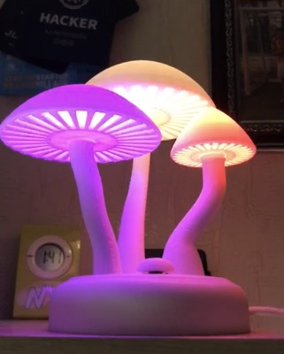
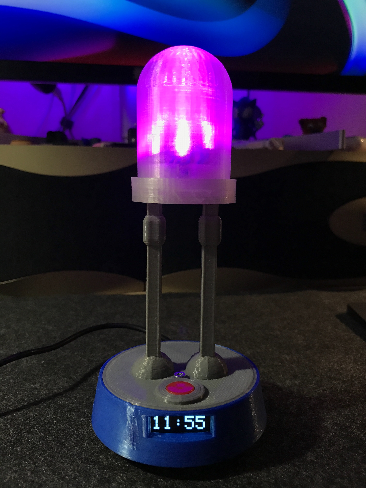

## Arduino, ESP8266, Raspberry Pi projects

|      |   Projects   | |
| :------------- | :------------- | :------------- |
| 🚨 RGB Electric Mushrooms [[source files](mushrooms/mushrooms.ino)]   | 🚨🖥🕰 Giant LED with OLED display [[source files](giant_led_w_time/giant_led_w_time.ino)]   |   |
| 📡🕹🚨 Controlling Servo motor and LEDs with Arduino Nano using Joystick [[video demonstration](https://youtu.be/dMZIztaue5U)] [[source files](servo_leds/servo_leds.ino)]        | 🚥🔘 Controlling LEDs with ESP8266, MQTT and Raspberry Pi [[video demonstration](https://youtu.be/Odutzy32P4A)] [[source files](esp8266_mqtt_led/esp8266_mqtt_led.ino)]        | 🚨🔘 Blinking LED and Button attached to Raspberry Pi [[video demonstration](https://youtu.be/iCikH7vxkV4)] [source files]  |
| 🔊🚨 Use Ultrasonic Sensor to control the brightness of attached to Arduino LED [[source files](ultrasonic_control_led_brightness/ultrasonic_control_led_brightness.ino)] | 📶🖥🕰🌦 This project also called as "Smart Clock". It contains three main screens - "Time", "Weather" and "Time 'till next Train" - and also it provides an HTTP-interface to control relay remotely (currently I'm controlling LED strip behind my monitor). Also it's possible to update firmware OTA [[video demonstration](https://youtu.be/e5m9LcypUGY)] [[source files](screen_http_relay_ota/screen_http_relay_ota.ino)]  | 🍃 Trying to simulate falling chars like in the Matrix movie [[source files](screen_matrix_falling_chars/screen_matrix_falling_chars.ino)]  |
| 🔅 Random fill animation for LED matrix [[video demonstration](https://youtu.be/I4N1hBCpM_c)] [[source files](led_matrix_random/led_matrix_random.ino)]  |  🍺 Measuring alcohol level in the air [[source files](alcohol_sensor/alcohol_sensor.ino)] | 🖼 Print custom image to the OLED display [[source files](screen_custom_image/screen_custom_image.ino)]  |
| 📶🔘 HTTP button made with ESP8266 [[video demonstration](https://youtu.be/kVxYsKuNqUk)] [[source files](esp8266_http_button/esp8266_http_button.ino)]    | 📶 HTTP-requests from ESP8266 [[source files](esp8266_request/esp8266_request.ino)]   |  📶 Script allows to update the firmware of esp8266 Over The Air (OTA) [[source files](update_over_the_air/update_over_the_air.ino)] |

| | Examples | |
| :------------- | :------------- | :------------- |
| ✳️ Blink with built-in LED [[source files](esp8266_blink/esp8266_blink.ino)]       | 🚨🔘 Button and attached LED [[source files](esp8266_button/esp8266_button.ino)]       | 🕹 Read data from attached Joystick to Arduino [[source files](example_joystick/example_joystick.ino)] |
| 📡 Usage example of Servo motor [[source files](example_servo/example_servo.ino)]   |  💤 Breathing LED using PWM [[source files](led_breathing/led_breathing.ino)]   | 🎤 Measuring level of noise (with cheap microphone) [[source files](cheap_microphone/cheap_microphone.ino)] |
| 📶🚨 Controlling external LED via HTTP [[source files](control_over_http/control_over_http.ino)]   | 💠 Animated Pacman for LED matrix [[source files](led_matrix_pacman/led_matrix_pacman.ino)]   | 🧭 Read gyroscope and accelerometer data from the sensor [[source files](gyroscope_accelerometer/gyroscope_accelerometer.ino)]  |
| 🈯️ Print all available chars to the OLED display [[source files](screen_all_chars/screen_all_chars.ino)]   |  🔊🚨 Use Ultrasonic Sensor to control attached to Arduino LED [video demonstration] [[source files](ultrasonic/ultrasonic.ino)] |  🔊🚨 Use Ultrasonic Sensor to control attached to Arduino LED (using _NEWPING_ library instead of _ULTRASONIC_ library) [[source files](ultrasonic_newping_library/ultrasonic_newping_library.ino)] |
| 📳 Vibration Sensor [[source files](vibration_sensor/vibration_sensor.ino)]   |   |   |
